# uni-push 推送服务配置指南

::: tip 前言
uni-push 是 DCloud 推出的统一推送服务，整合了各大手机厂商的推送通道，开发者只需一次接入即可实现多端推送。
:::

## 一、开通 uni-push 服务

### 1.1 项目配置推送服务

在 HBuilderX 中为项目开启推送服务：

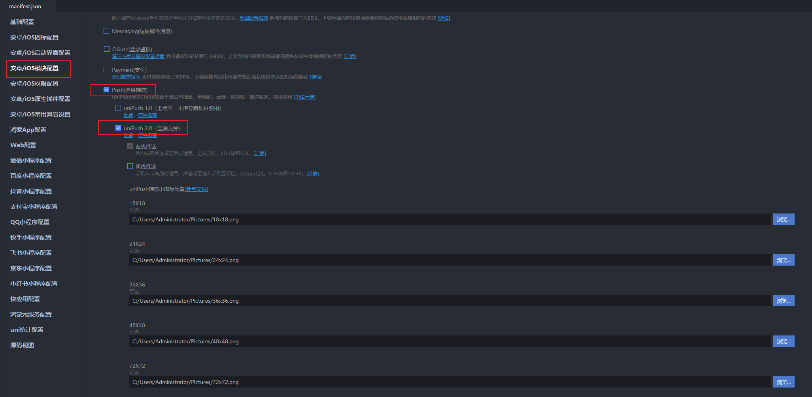

### 1.2 DCloud 开发者中心配置

访问 [DCloud 开发者中心](https://dev.dcloud.net.cn) 配置推送信息：

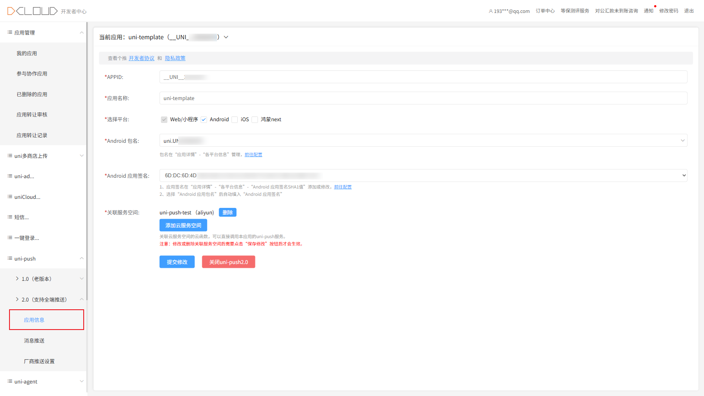

## 二、云函数配置

::: warning 注意
以下操作需要在 HBuilderX 中进行。
:::

### 2.1 创建云函数

1. 右键项目 → 新建 → 云函数

   

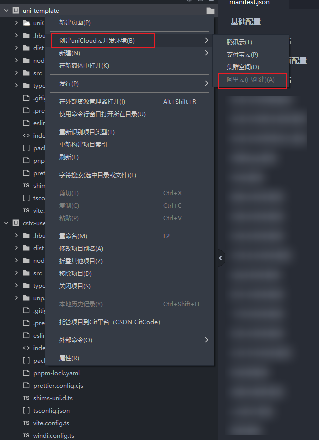

2. 选择云函数模板

   

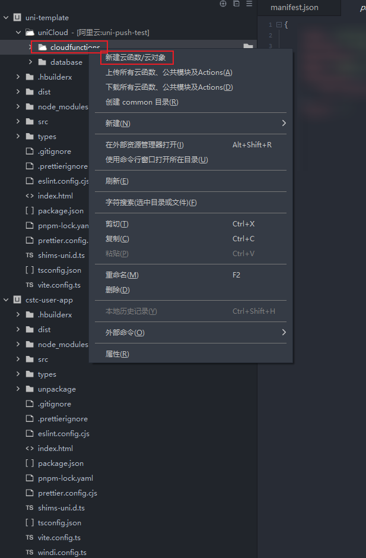

3. 填写云函数名称（如 `pushTest`）

   

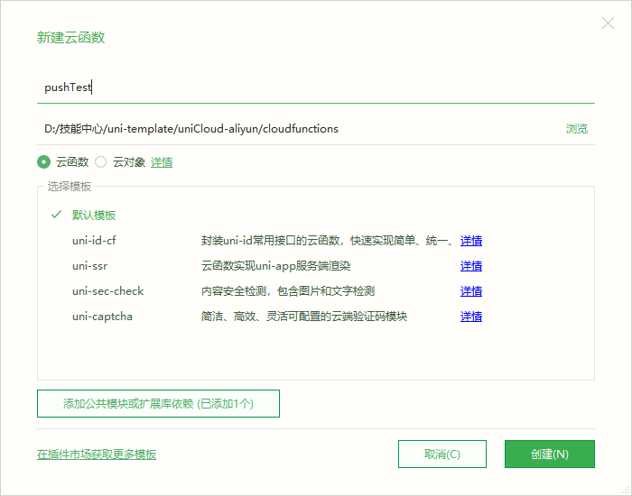

4. 创建完成后，目录结构如下：

   

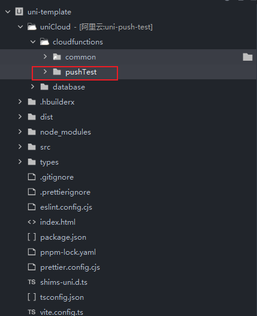

### 2.2 配置 package.json

```json
{
  "name": "pushTest",
  "version": "1.0.0",
  "description": "uni-push 推送云函数",
  "main": "index.js",
  "extensions": {
    "uni-cloud-push": {}
  },
  "author": ""
}
```

### 2.3 编写推送逻辑

```javascript
'use strict';

const uniPush = uniCloud.getPushManager({
    appId: "__UNI__29D66FD" // 替换为你的应用 AppID
});

exports.main = async (event, context) => {
    let body = typeof event.body === 'string' ?
        JSON.parse(event.body) :
        event.body;

    const {
        type
    } = body;

    switch (type) {
        // #region ======================== 单播推送 ========================
        // 推送给单个设备
        case 'unicast':
            return await uniPush.sendMessage({
                push_clientid: body.cid,
                title: body.title,
                content: body.content,
                payload: body.payload,
                force_notification: true
            });
            // #endregion ======================== End of 单播推送 ========================

            // #region ======================== 多播推送 ========================
            // 推送给多个指定设备
        case 'multicast':
            return await uniPush.sendMessage({
                push_clientid: body.cidList, // ['cid1', 'cid2', 'cid3']
                title: body.title,
                content: body.content,
                payload: body.payload,
                force_notification: true
            });
            // #endregion ======================== End of 多播推送 ========================

            // #region ======================== 全量广播 ========================
            // 推送给所有用户
        case 'broadcast':
            return await uniPush.sendMessageToAll({
                title: body.title,
                content: body.content,
                payload: body.payload,
                force_notification: true
            });
            // #endregion ======================== End of 全量广播 ========================

            // #region ======================== 别名推送 ========================
            // 推送给绑定了别名的用户（如用户ID）
        case 'alias':
            return await uniPush.sendMessage({
                alias: body.alias, // 如 'user_12345'
                title: body.title,
                content: body.content,
                payload: body.payload,
                force_notification: true
            });
            // #endregion ======================== End of 别名推送 ========================

        default:
            return {
                code: -1,
                    msg: '未知的推送类型'
            };
    }
};
```

### 2.4 部署云函数

编写完成后，右键云函数目录选择「上传部署」：

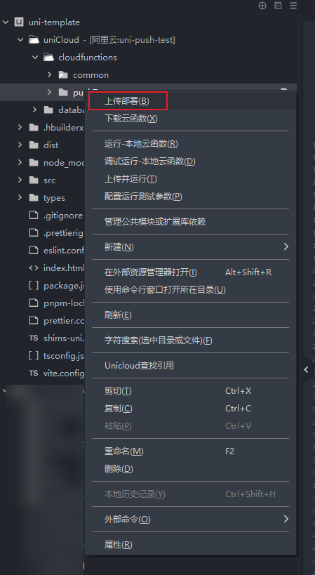

### 2.5 配置数据库 Schema

在 `database` 目录下创建以下 Schema 文件（文件内容见附件）：

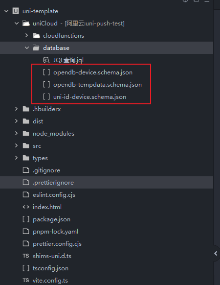

为每个文件执行「上传 DB Schema」操作：

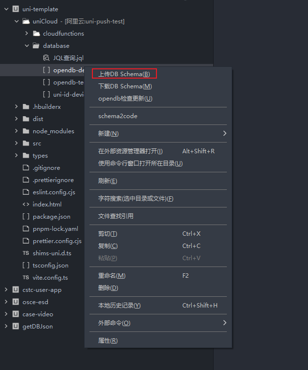

## 三、服务空间域名配置

### 3.1 进入服务空间管理

访问 [uniCloud 控制台](https://unicloud.dcloud.net.cn)，进入当前配置推送的服务空间：

### 3.2 绑定域名

点击「域名绑定」进入配置页面：

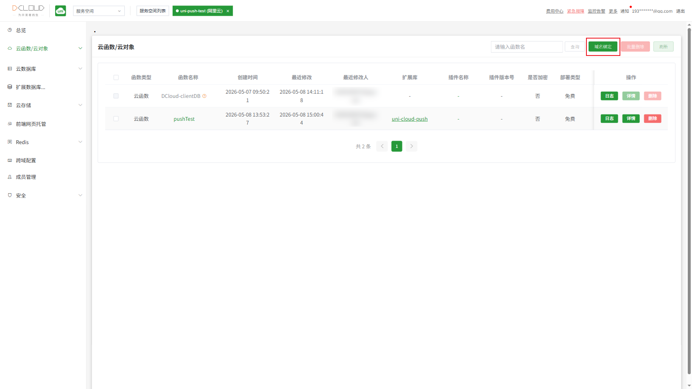

### 3.3 配置访问域名

系统提供测试域名供开发使用，正式环境需要绑定自己的域名：

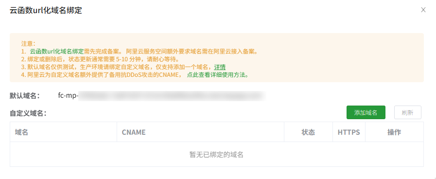

点击「详情」进行路径配置：

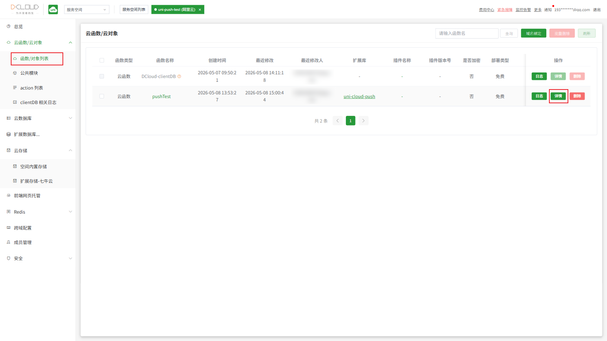

添加云函数访问路径后缀：

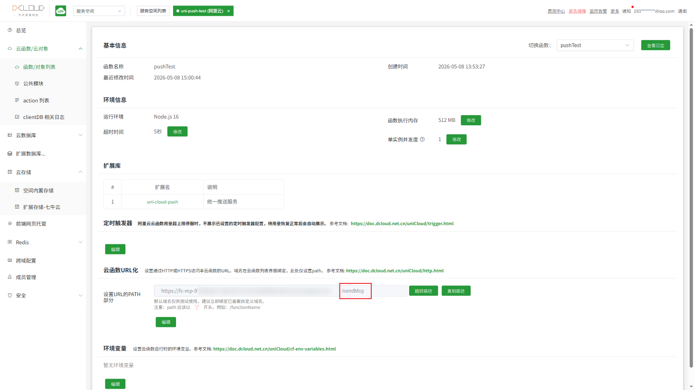

## 四、测试推送

配置完成后，可通过以下方式测试推送功能：

### 4.1 使用 Apifox 测试

在 Apifox 中请求云函数地址，传递以下参数：

```json
{
  "type": "multicast",
  "cid": "93",
  "cidList": [
    "xxx"
  ],
  "title": "title",
  "content": "contentcontent",
  "payload": "xxx"
}
```

::: tip 参数说明
* `type`: 推送类型（`unicast` 单播 / `multicast` 多播 / `broadcast` 广播 / `alias` 别名）
* `cid`: 单播时的目标客户端 ID
* `cidList`: 多播时的目标客户端 ID 数组
* `title`: 推送消息标题
* `content`: 推送消息内容
* `payload`: 自定义透传数据
:::

### 4.2 推送类型对照表

| 类型 | 说明 | 必需参数 |
|------|------|----------|
| `unicast` | 单播推送 | `cid` |
| `multicast` | 多播推送 | `cidList` |
| `broadcast` | 全量广播 | 无 |
| `alias` | 别名推送 | `alias` |

## 五、常见问题

### Q: 如何获取客户端 CID？

在 App 端调用以下代码获取：

```javascript
uni.getPushClientId({
    success: (res) => {
        console.log('客户端 CID:', res.cid);
    }
});
```

### Q: 推送收不到怎么办？

1. 检查应用是否已开通 uni-push 服务
2. 确认云函数已正确部署
3. 验证客户端 CID 是否正确
4. 检查手机通知权限是否开启
