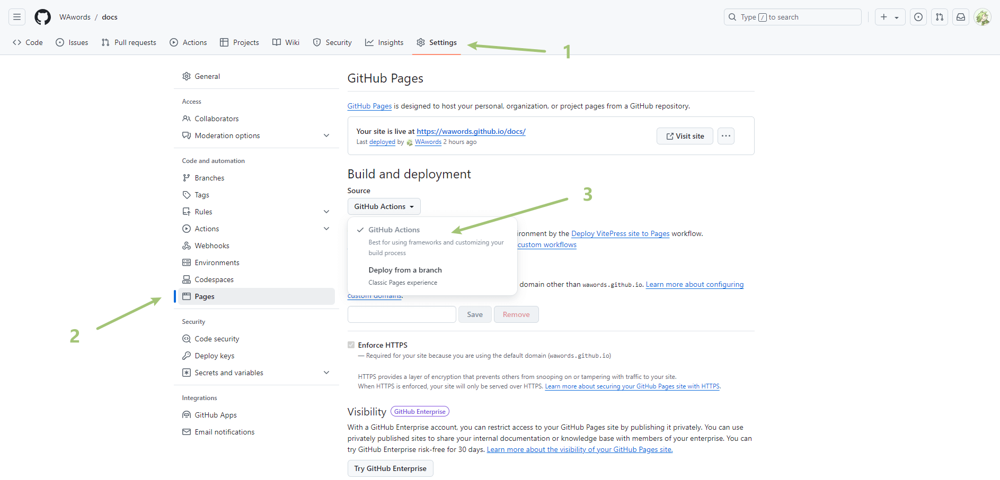

# 部署

我们将使用 GitHub Pages 来部署我们的 VitePress 站点，可以将整个部署过程分为项目本体的配置和 GitHub Pages 的配置。

## 创建 GitHub 仓库

在 GitHub 上创建一个空仓库，仓库名称是 `docs`。

> [!TIP]
> 在这个部署流程中，我们创建的 GitHub 仓库是 `docs`，记住它，因为在项目中的配置需要用到。

## 项目配置

### 初始化项目

创建文件夹 `docs`，并进入文件夹，安装 vitepress：

::: code-group

```sh [pnpm]
pnpm add -D vitepress
```

:::

安装完成后，使用 VitePress 附带的命令行设置向导构建一个基本项目：

::: code-group

```sh [pnpm]
pnpm vitepress init
```

:::

执行命令后需要回答一些问题：

```sh{4,7,10,13}
┌  Welcome to VitePress!
│
◇  Where should VitePress initialize the config?
│  ./docs
│
◇  Site title:
│  My Awesome Project
│
◇  Site description:
│  A VitePress Site
│
◆  Theme:
│  ● Default Theme (Out of the box, good-looking docs)
│  ○ Default Theme + Customization
│  ○ Custom Theme
└
```

回答完问题后，项目就已经初始化成功了。

### git 初始化

在项目根目录下执行以下命令：

```sh
git init
```

在项目根目录下创建 `.gitignore` 文件，并添加以下内容：

```
node_modules
cache
dist
*.local
```

然后我们将创建的 GitHub 仓库设置为远程仓库。

### 配置 base URL

我们将创建的 GitHub 仓库名称是 `docs`，其对应的站点地址为`https://xxxxxx.github.io/docs/`，所以我们需要配置 `base` 为 `/docs/`。

找到 `docs/.vitepress/config.mts` 文件，修改 `base` 为 `/docs/`：

```ts{5}
// docs/.vitepress/config.mts

/// ...
export default defineConfig({
  base: "/docs/",
  /// ...
});
```

### 配置 GitHub 工作流程

在项目的 `.github/workflows` 目录中创建一个名为 `deploy.yml` 的文件，其中包含这样的内容：

```yaml
name: Deploy VitePress site to Pages

on:
  push:
    branches: master # 你的分支名

  workflow_dispatch:

permissions:
  contents: read
  pages: write
  id-token: write

concurrency:
  group: pages
  cancel-in-progress: false

jobs:
  build:
    runs-on: ubuntu-latest
    steps:
      - name: Checkout
        uses: actions/checkout@v4
        with:
          fetch-depth: 0
      - uses: pnpm/action-setup@v3 # 使用pnpm
        with:
          version: 9 # 指定pnpm版本
      - name: Setup Node
        uses: actions/setup-node@v4
        with:
          node-version: 20
          cache: pnpm # 使用pnpm
      - name: Setup Pages
        uses: actions/configure-pages@v4
      - name: Install dependencies
        run: pnpm install # 使用pnpm
      - name: Build with VitePress
        run: pnpm docs:build # 使用pnpm
      - name: Upload artifact
        uses: actions/upload-pages-artifact@v3
        with:
          path: docs/.vitepress/dist

  # 部署工作
  deploy:
    environment:
      name: github-pages
      url: ${{ steps.deployment.outputs.page_url }}
    needs: build
    runs-on: ubuntu-latest
    name: Deploy
    steps:
      - name: Deploy to GitHub Pages
        id: deployment
        uses: actions/deploy-pages@v4
```

好了，项目上的配置就搞定了。

## GitHub Pages 配置

在存储库 `Settings` 中的 `Pages` 菜单项下，选择 `Build and deployment > Source > GitHub Actions`：



设置好之后，回到你的项目，推送你的代码到 GitHub，GitHub Actions 就会自动执行，并部署站点。

你可以在 `Actions` 菜单项下查看执行情况：


